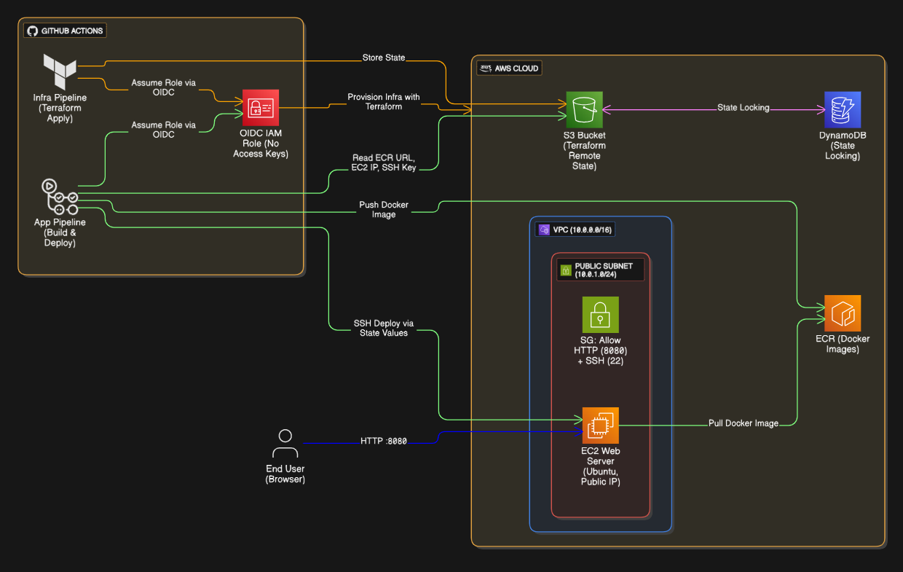

# Terraform + GitHub Actions + AWS Deployment

Complete CI/CD pipeline for deploying containerized applications to AWS using Terraform and GitHub Actions with OIDC authentication.

## 🏗️ Architecture



## 🚀 Quick Start

### 1. Bootstrap (One-time setup)
```bash
cd bootstrap
terraform init
terraform apply
# Note the OIDC role ARN output
```

### 2. Configure GitHub Secrets
- `AWS_ACCOUNT_ID` - Your AWS account ID
- Other secrets are auto-populated by infra pipeline

### 3. Deploy Infrastructure
Push changes to `infra/` folder to trigger infrastructure deployment.

### 4. Deploy Application
Push changes to `app/` folder to trigger application deployment.

## 🔧 Configuration

### Infrastructure (infra/locals.tf)
- **Region**: eu-north-1
- **Instance**: t3.micro Ubuntu
- **Ports**: 22 (SSH), 8080 (App)
- **VPC**: 10.0.0.0/16

### Application
- **Framework**: Flask
- **Port**: 8080
- **Health Check**: `/health` endpoint
- **Container**: Python 3.10-slim

## 🔐 Security Features

- **OIDC Authentication**: No long-lived AWS keys
- **Least Privilege IAM**: Minimal required permissions
- **Private ECR**: Secure container registry
- **SSH Key Generation**: Automatic keypair creation
- **Health Checks**: Container monitoring

## 🚨 Important Notes

- Bootstrap must be run locally first (only once)
- Infrastructure changes trigger via `infra/` path changes
- Application deploys trigger via `app/` path changes
- SSH keys are auto-generated and stored in GitHub Secrets
