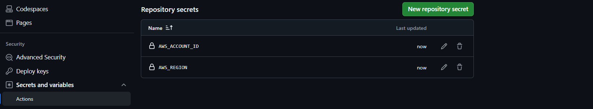
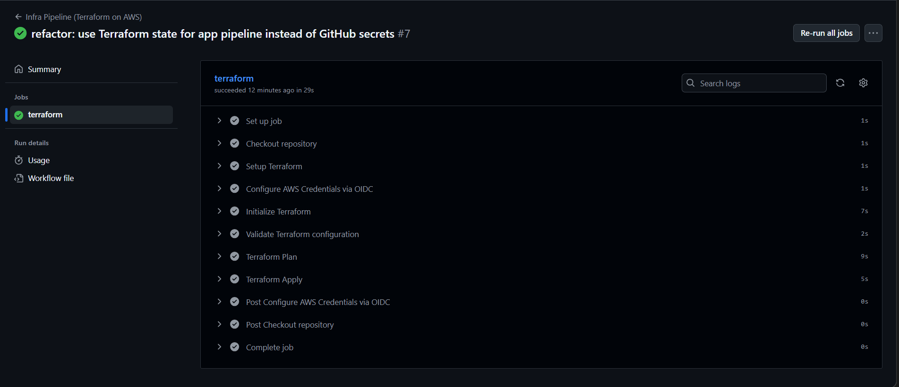
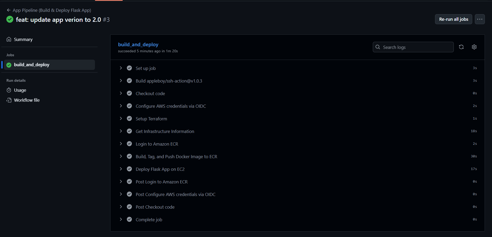
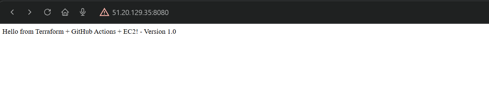
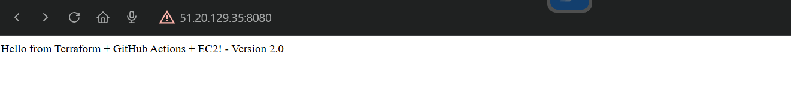
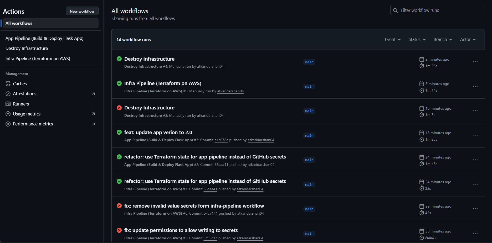
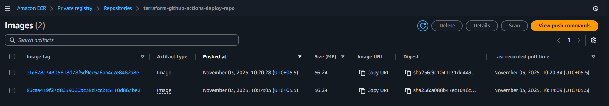
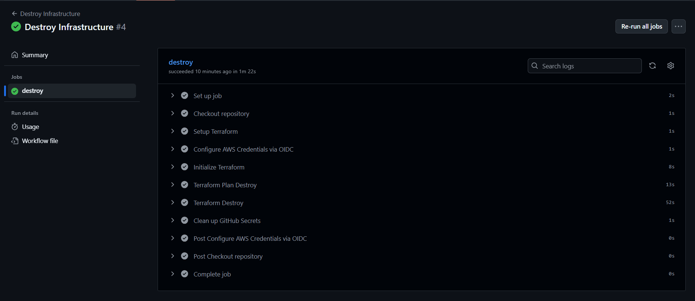

# 🚀 Terraform + GitHub Actions + AWS Automation

Complete CI/CD automation pipeline for AWS infrastructure deployment and application CI/CD automation directly on AWS infrastructure using Terraform , GitHub Actions, and OIDC authentication.

## 🏗️ Architecture Overview


This project implements a modern DevOps automation pipeline with:
- **Infrastructure as Code** using Terraform with remote state
- **Secure Authentication** via OIDC (no long-lived AWS keys)
- **Automated CI/CD** with GitHub Actions workflows
- **Application Deployment** directly to AWS infrastructure (ECR, ECS, Lambda)
- **Remote State Management** with S3 and DynamoDB

## 🎯 What This Project Does

This automation pipeline demonstrates a fully connected DevOps workflow where:
- **Infrastructure provisioning** automatically creates AWS resources (VPC, ECS, ECR)
- **Application deployment** builds and deploys containerized apps to the provisioned infrastructure
- **End-to-end automation** connects infrastructure creation to application deployment seamlessly
- **Zero manual intervention** - from code push to running application on AWS
- **Secure authentication** using OIDC without storing AWS credentials

## 🎯 Automated Deployment Guide

### Step 1: Bootstrap Infrastructure (One-time Setup)

The bootstrap creates foundational AWS resources for secure automation.

```bash
cd bootstrap
terraform init
terraform plan
terraform apply
```

**Creates:**
- OIDC Provider for GitHub Actions
- IAM roles with repository-scoped access
- S3 bucket for Terraform state (encrypted)
- DynamoDB table for state locking

### Step 2: Configure GitHub Repository Secrets

Go to **Settings** → **Secrets and variables** → **Actions** and add:

| Secret Name | Value | Description |
|-------------|-------|-------------|
| `AWS_ACCOUNT_ID` | Your 12-digit AWS account ID | Required for OIDC role assumption |
| `AWS_REGION` | `eu-north-1` (or your preferred region) | AWS region for deployments |



### Step 3: Automated Infrastructure Deployment

Infrastructure changes are automatically deployed via GitHub Actions:

```bash
# Any change to /infra triggers deployment
cd infra
echo "# Infrastructure update" >> main.tf
git add .
git commit -m "Update infrastructure"
git push origin main
```



### Step 4: Automated Application Deployment

Application deployments are triggered automatically:

```bash
# Any change to /app triggers deployment
cd app
echo "# Application update" >> app.py
git add .
git commit -m "Update application"
git push origin main
```



### Step 5: Verify Deployment

1. Log in to AWS Console
2. Navigate to EC2 and take the public IP of the ECS instances
3. In your browser, go to `http://<ECS_INSTANCE_PUBLIC_IP>:8080`





## 📊 Automation Results

### GitHub Actions Workflows


### AWS Resources


## 🧹 Automated Cleanup

### Infrastructure Destruction
1. Go to GitHub **Actions** tab
2. Select "Destroy Infrastructure" workflow
3. Click "Run workflow"
4. Type `DESTROY` in confirmation
5. Click "Run workflow"



---
